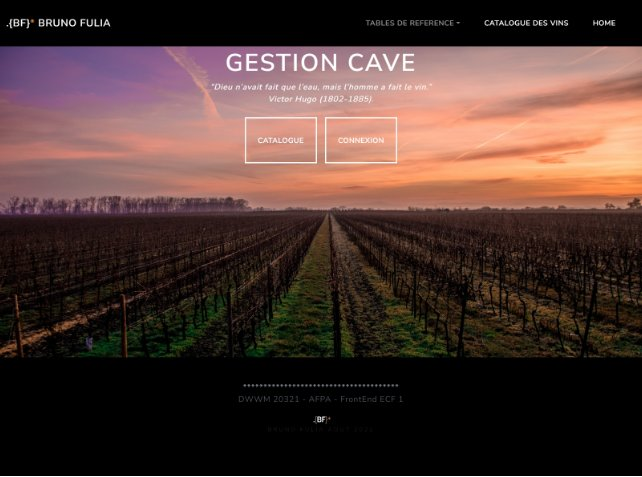
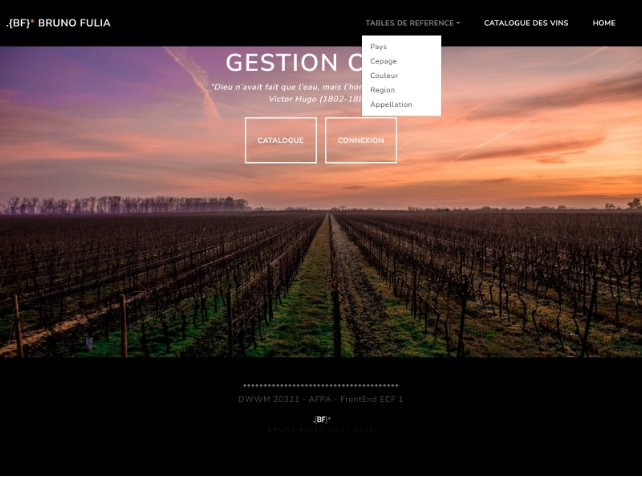
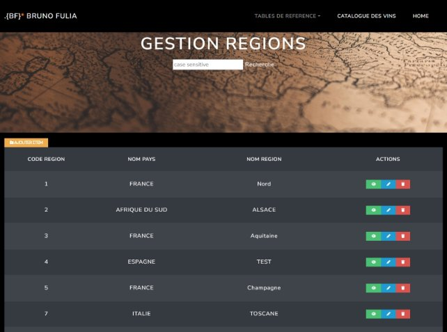
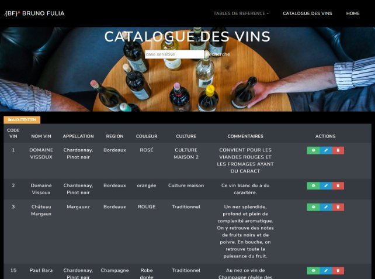
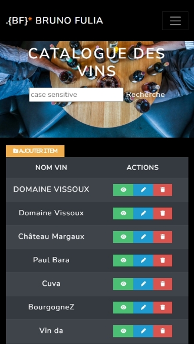
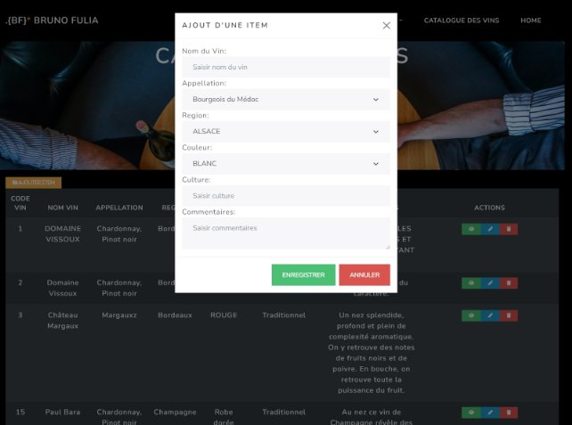
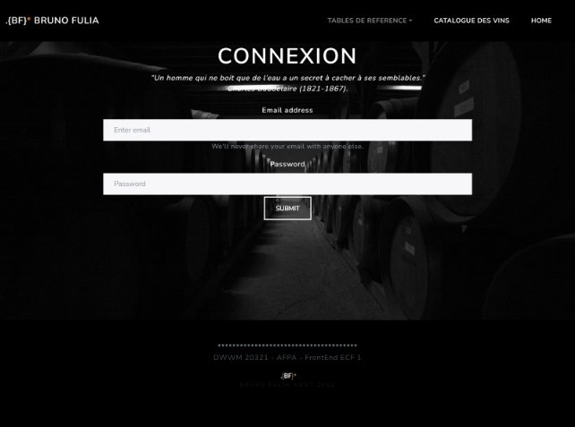

# Projet Gestion Cave

**1.-** **Cahier des Charges**

Un client nous a commandé une application qui lui permettra de gérer sa cave. Il voudra gérer son stock et gérer aussi les accords mets/vins.

Chaque vin appartient à un pays, une région, une appellation et un cépage sous la forme de références. Un vin a une couleur mais une appellation peut avoir plusieurs couleurs de vin. 

Un vin peut s’accorder avec plusieurs mets et inversement.

Le gestionnaire de la cave peut gérer les références, les accords mets/vins, les stocks et peut consulter les événements en rapport avec la dégustation d’un vin.

Le sommelier peut gérer les accords mets/vins et les stocks.

Un service distant, web-service, doit permettre de consulter les stocks, les accords mets/vins et les événements associés aux dégustations.

**2.- Description du Site Web**

Le site est composé de: 

- Une page d'accueil, 
- Plusieurs pages pour la gestion des références:	
  - Pays,
  - Cépage,
  - Couleur,
  - Région
  - Appellation
- Une page pour le Catalogue de Vins 
- Une page « Connexion » pour la gestion du niveau d'accès des différents types d'utilisateurs.

**2.1.- Page de Accueil**

En arrivant sur le site, nous trouvons une page d’accueil, qui comporte une barre de navigation, à l'intérieur de laquelle se trouvent les liens vers les différentes pages de gestion des tableaux ainsi que le retour à la page d'accueil. Cette barre de navigation est présente sur toutes les pages.

Au centre de l'écran se trouvent deux boutons qui nous permettent d'accéder à la page de connexion et au catalogue des vins (également accessible depuis la barre de navigation).** 

En diminuant la taille de l'écran, la barre de navigation devient pliable et les boutons sont repositionnés.

*Détail des Dispositifs Mobiles*

**2.2.- Tables de Référence**

2\.2.1.- Tableaux de Gestion Simples

Les pages consommant des informations fournies par des APIs simples (Pays, Cépage, Couleur, Appellation), comportent un champ de recherche et des boutons d’action permettant de manipuler les informations reçues des APIs.

Lorsque la fenêtre est réduite, la première colonne disparaît et les autres colonnes adaptent leur taille pour occuper l’espace disponible.

2\.2.2.- Tableau de Gestion de Régions

Ce tableau consomme des informations fournies par une API de complexité moyenne. 

Dans la version desktop, il génère un tableau de quatre colonnes et, comme dans le cas précédent, il comporte un champ de recherche et des boutons d'action permettant de manipuler les informations reçues de l’API.

Lorsque la taille de la fenêtre diminue, la première et la deuxième colonnes disparaissent et les autres colonnes adaptent leur taille pour occuper l’espace disponible. Les informations cachées dont accessibles via le bouton « VUE ».

**2.3.- Catalogue des Vins**

Ce tableau consomme des informations fournies par une API plus complexe que les cas précédents.

Dans la version desktop, il génère un tableau de huit colonnes et, comme dans les cas précédents, il dispose d'un champ de recherche et de boutons d'action qui vous permettent de manipuler les informations reçues de l'API.

\*	Dans le cas de cette tableau, lorsque la taille de la fenêtre diminue, toutes les colonnes disparaissent, sauf NOM DU VIN et ACTIONS, qui adaptent leur taille pour occuper l’espace disponible.

**2.4.- Boutons des Actions**

Chaque page présente quatre boutons qui vous permettent d'interagir avec les données fournies par l'API:

- Ajout Item.
- Vue Item.
- Modifier Item.
- Supprimer Item.

2\.4.1.- Bouton Ajouter Item

Ce bouton Ouvre une fenêtre modale qui vous permet d’ajouter un élément a la base de données. Sa configuration change en fonction de la complexité de la table gérée.

*(Ordinateur  Générique)*

2\.4.2.- Bouton Vue Item

Ce bouton ouvre une fenêtre modale qui vous permet d’afficher les détails d’un élément. Il est particulièrement utile lorsque vous utilisez l’application sur des appareils a petite écran.

2\.4.3.- Bouton Modifier Item

Ce bouton ouvre une fenêtre modale qui vous permet de modifier les détails d’un élément. La zone « Code du Vin » est gérée automatiquement par l’API et ne peut être modifiée.

2\.4.4.- Bouton Supprimer Item

Ce bouton ouvre une fenêtre modale qui vous permet de supprimer un élément. Cette fenêtre, ainsi que les fenêtres « Ajouter » et « Modifier », ouvrent une nouvelle fenêtre de confirmation avant de procéder a l’action souhaitée.

**2.5.- Page Connexion**

Page de connexion pour gérer le niveau d’accès des différents types d’utilisateurs. 

**3.- Dossier Technique**

**3.1.- Général**

L’application a été développe en utilisant les langages de programmation HTML, CSS et JavaScript, pour consommer les APIs distant via des requêtes AJAX.

Pour gérer le « Style » et la « Réactivité » de la page web j’ai utilise Bootstrap 5, complété par du CSS pur pour des occasions spécifiques (par exemple, des media-queries employées pour cacher les colonnes dans les tableaux).

Le site a été code en utilisant « Vanilla » JavaScript et des fichiers de classe (Ajax, Table et Combo), qui ont été lies en tant que modules a l’aide des directives spéciales import/export.

**3.2.- PAGE.HTML**

Cette image représentent la structure basique de la partie head de chaque fichier HTML. Bootstrap 5 et les Icônes sont chargés à partir de serveurs https, et dans les balises de style se trouve le CSS individuel pour chaque page.

Cette deuxième image représentent la structure basique de la partie body de chaque fichier HTML.

La zone identifiée comme "DIV POUR TABLE" est une balise div vide qui recevra la table générée par le fichier page.js en utilisant la class\_table importée.

Bien que la class\_table dispose de la méthode permettant de générer automatiquement ses propres modales, pour ce projet, j'ai choisi de développer les modales directement dans chaque page HTML.

**3.3.- PAGE.JS**

Cette image représentent la structure basique de la importation de éléments JavaScript et génération des tableaux de chaque fichier page.js. Les objets ajax sont importés du fichier init.js, puis utilisés pour générer les tableaux et les combos, importés de leurs classes respectives.

La fonction « retourParse » prend les informations obtenues de l'API par la méthode « get » de l'objet « Ajax », transforme la réponse par la méthode « JSON.parse » et utilise ces informations pour générer les tableaux à insérer dans le « div » prévu à cet effet dans le fichier page.html, en utilisant la méthode « generer » de la class\_table.

Les fonctions « Ouvrir Modals » capturent les valeurs présentes dans la ligne du tableau sélectionné et les affichent dans le champ correspondant de chaque modal. 	S'il s'agit d'une modale de création, de modification ou de suppression, lorsque vous cliquez sur enregistrer, ils capturent les informations présentes dans les champs de la modale, les ajoutent à la variable "ajoutInfo" et utilisent ces informations pour créer, ajouter ou supprimer des informations de la base de données à l'aide des méthodes fournies dans la classe « Ajax » (post, put et del).

Les fonctions « alimenter\_Combo » et « retourAjaxGet » utilisent la méthode « get » de la classe « Ajax » pour consommer l'API correspondante et générer un « combo select » avec les informations obtenues, qui sera utilisé par les modales « Ajouter » et « Modifier » des APIs « Régions » et « Vins ».

Lorsque le programme principal démarre, la méthode « Get » de l'objet « Ajax » est exécutée pour générer le tableau, les « combos select » sont initialisés, et les « addEventListener » de la fonction de recherche et des boutons de confirmation d'action sont chargés.

**3.4.- INIT.JS**

Le fichier init.js importe la classe « Ajax » et l'utilise, ainsi que les urls définies dans ce fichier, pour générer les objets « Ajax » qui seront exportés vers le reste des fichiers au fur et à mesure de leurs besoins.

**3.5.- CLASS\_AJAX.JS**

Cette classe permet la création d'objets « Ajax » et fournit les méthodes « get », « post », « put » et « del », qui sont utilisées pour consommer l'APIs en obtenant, créant, modifiant ou supprimant des informations respectivement.

**3.6.- CLASS\_TABLE.JS**

La classe « Table » est importée par le fichier « page.js » pour générer les tableaux à insérer dans le corps du fichier « page.html ». 

Cette première image montre la liste des propriétés que cette classe a la possibilité d'utiliser pour générer les tableaux de manière dynamique. 

L'image ci-dessous montre le code de la classe table pour la génération des en-têtes et des lignes, à partir des informations contenues dans Table.data.

Ensuite, les boutons d'action sont créés et, enfin, la classe se charge d'insérer le tableau par la méthode « document.innerHTML » et d'ajouter les « addEventListener » aux boutons d'action.

**3.7.- CLASS\_COMBO.JS**

La classe « Combo » est importée par le fichier « page.js » pour générer les « combo select » à insérer dans les modals du fichier « page.html ».

